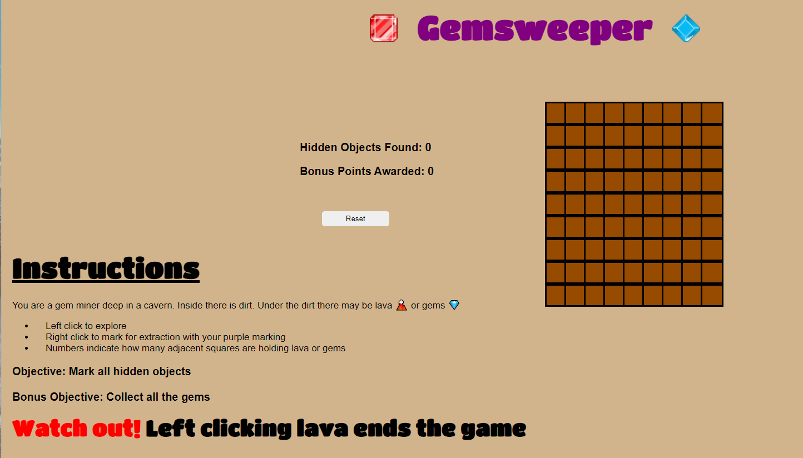

# Gemsweeper: A New Twist on Minesweeper

## Date: 3/11/22

### By: Lawrence O'Regan-Lloyd

### [Twitter](https://twitter.com/Lawrence_OL) | [Github](https://github.com/LawrenceOL) | [LinkedIn](https://www.linkedin.com/in/lawrenceol/)

### [Trello Planning Board](https://trello.com/b/41J9d4Sg/gemsweeper)
### [Deployed Game](https://www.lawrenceol.dev/tictactoe.html)
---

### ***Description***

### A mining themed twist on the classic game Minesweeper
#### Click boxes to explore. Numbers indicate the adjacent hidden objects. Right click suspected objects to flag them for removal. Flag all the hidden objects to win! Bonus points awarded for each gem object discovered

---

### ***Technologies Used***

- HTML
- CSS
- JavaScript

### ***Gameplay Images***

#### Can you avoid the lava?

### ***Future Updates***

- [ ] Add mobile interaction
- [ ] Integrate sounds and game tile animations
- [ ] Include multiple difficulty settings
- [ ] Enable replay on the same board layout

### ***Want to Install Locally?***
#### To play locally, simply download all the files and open index.html in your browser

### ***Credits***
#### "Shiny Jewels" images by softwareatelier from [opengameart.org](https://opengameart.org/users/softwareatelier)
#### [Titan One Font](https://fonts.google.com/specimen/Titan+One) by [Rodrigo Fuenzalida](https://fonts.google.com/?query=Rodrigo%20Fuenzalida) from Google Fonts 
#### Similar gameplay has been seen in games such as Jerimac Ratliff's *Cube* and the Windows 3.1 classic *Microsoft Minesweeper*
#### Lava and gem elements inspired by Mojang's [Minecraft](https://www.minecraft.net/) 
#### Special thanks to the members of the 2-22 GA SEI Cohort

